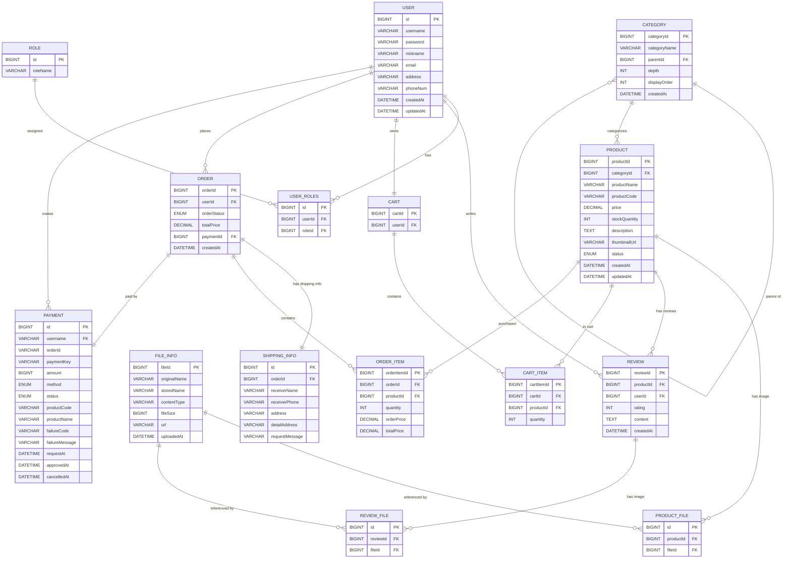

# devshop-proj

```mermaid
erDiagram

    %% ============================
    %% SHIPPING INFO 추가
    %% ============================
    SHIPPING_INFO {
        BIGINT id PK
        BIGINT orderId FK
        VARCHAR receiverName
        VARCHAR receiverPhone
        VARCHAR address
        VARCHAR detailAddress
        VARCHAR requestMessage
    }

    ORDER ||--|| SHIPPING_INFO : "has shipping info"

    %% ============================
    %% USER & ROLE
    %% ============================
    USER {
        BIGINT id PK
        VARCHAR username
        VARCHAR password
        VARCHAR nickname
        VARCHAR email
        VARCHAR address
        VARCHAR phoneNum
        DATETIME createdAt
        DATETIME updatedAt
    }

    ROLE {
        BIGINT id PK
        VARCHAR roleName
    }

    USER_ROLES {
        BIGINT id PK
        BIGINT userId FK
        BIGINT roleId FK
    }

    USER ||--o{ USER_ROLES : "has"
    ROLE ||--o{ USER_ROLES : "assigned"

    %% ============================
    %% CATEGORY & PRODUCT
    %% ============================
    CATEGORY {
        BIGINT categoryId PK
        VARCHAR categoryName
        BIGINT parentId FK
        INT depth
        INT displayOrder
        DATETIME createdAt
    }

    PRODUCT {
        BIGINT productId PK
        BIGINT categoryId FK
        VARCHAR productName
        VARCHAR productCode
        DECIMAL price
        INT stockQuantity
        TEXT description
        VARCHAR thumbnailUrl
        ENUM status
        DATETIME createdAt
        DATETIME updatedAt
    }

    CATEGORY ||--o{ CATEGORY : "parent of"
    CATEGORY ||--o{ PRODUCT : "categorizes"

    %% ============================
    %% FILE MANAGEMENT
    %% ============================
    FILE_INFO {
        BIGINT fileId PK
        VARCHAR originalName
        VARCHAR storedName
        VARCHAR contentType
        BIGINT fileSize
        VARCHAR url
        DATETIME uploadedAt
    }

    PRODUCT_FILE {
        BIGINT id PK
        BIGINT productId FK
        BIGINT fileId FK
    }

    REVIEW_FILE {
        BIGINT id PK
        BIGINT reviewId FK
        BIGINT fileId FK
    }

    PRODUCT ||--o{ PRODUCT_FILE : "has image"
    FILE_INFO ||--o{ PRODUCT_FILE : "referenced by"

    REVIEW ||--o{ REVIEW_FILE : "has image"
    FILE_INFO ||--o{ REVIEW_FILE : "referenced by"

    %% ============================
    %% REVIEW
    %% ============================
    REVIEW {
        BIGINT reviewId PK
        BIGINT productId FK
        BIGINT userId FK
        INT rating
        TEXT content
        DATETIME createdAt
    }

    USER ||--o{ REVIEW : "writes"
    PRODUCT ||--o{ REVIEW : "has reviews"

    %% ============================
    %% CART
    %% ============================
    CART {
        BIGINT cartId PK
        BIGINT userId FK
    }

    CART_ITEM {
        BIGINT cartItemId PK
        BIGINT cartId FK
        BIGINT productId FK
        INT quantity
    }

    USER ||--|| CART : "owns"
    CART ||--o{ CART_ITEM : "contains"
    PRODUCT ||--o{ CART_ITEM : "in cart"

    %% ============================
    %% ORDER
    %% ============================
    "ORDER" {
        BIGINT orderId PK
        BIGINT userId FK
        ENUM orderStatus
        DECIMAL totalPrice
        BIGINT paymentId FK
        DATETIME createdAt
    }

    ORDER_ITEM {
        BIGINT orderItemId PK
        BIGINT orderId FK
        BIGINT productId FK
        INT quantity
        DECIMAL orderPrice
        DECIMAL totalPrice
    }

    USER ||--o{ ORDER : "places"
    ORDER ||--o{ ORDER_ITEM : "contains"
    PRODUCT ||--o{ ORDER_ITEM : "purchased"

    %% ============================
    %% PAYMENT
    %% ============================
    PAYMENT {
        BIGINT id PK
        VARCHAR username FK
        VARCHAR orderId
        VARCHAR paymentKey
        BIGINT amount
        ENUM method
        ENUM status
        VARCHAR productCode
        VARCHAR productName
        VARCHAR failureCode
        VARCHAR failureMessage
        DATETIME requestAt
        DATETIME approvedAt
        DATETIME cancelledAt
    }

    USER ||--o{ PAYMENT : "makes"
    ORDER ||--|| PAYMENT : "paid by"

```
# devshop_practice
